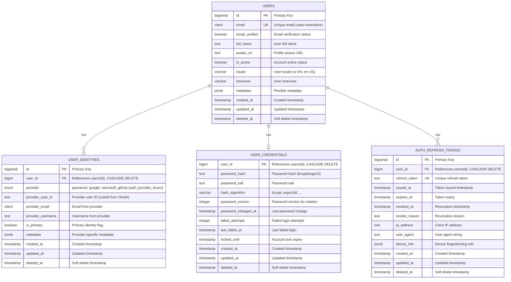

## Identity Domain – Database Schema

Mục tiêu: hỗ trợ **basic login (email/password)** và **multi‑provider OAuth** (Google, Microsoft, GitHub, …) theo chuẩn enterprise, dễ mở rộng, có **soft delete** và **audit log**.

Database: PostgreSQL.

---

## 1. Overview & Design Principles

- **User là entity trung tâm**: mọi thứ (profile, quyền, workspace, billing…) đều gắn vào `users`.
- **Tách "identity provider" khỏi user**:
  - 1 user có thể liên kết nhiều provider: password, google, microsoft, github, …  
  - Tránh tạo nhiều user trùng email khi login bằng nhiều provider.
  - Provider được định nghĩa bằng **enum** (`auth_provider_enum`) thay vì bảng riêng (hardcode config trong application).
- **Bảo mật**:
  - Password hash + salt, không lưu plain text.
  - **JWT-based authentication**: Access token (stateless, không lưu DB) + Refresh token (lưu trong `auth_refresh_tokens`).
- **Soft delete**: Tất cả bảng domain‑critical có `created_at`, `updated_at`, `deleted_at`.
- **Audit log (Optional)**: `identity_audit_logs` là optional cho MVP, có thể log vào application logs thay vì DB.

---

## 2. Tables

### 2.1. ENUM Types

**Vai trò**: Định nghĩa các enum core trong Identity domain.

```sql
-- Auth providers (config OAuth hardcode trong application)
CREATE TYPE auth_provider_enum AS ENUM (
    'password',   -- Basic email/password login
    'google',     -- Google OAuth2
    'microsoft'   -- Microsoft OAuth2
);

-- User roles (phân quyền đơn giản cho hệ thống)
CREATE TYPE user_role_enum AS ENUM (
    'user',       -- Tài khoản bình thường (mặc định)
    'admin'       -- Tài khoản quản trị hệ thống
);
```

**Ghi chú**:
- `auth_provider_enum`: đảm bảo type safety, thêm provider mới cần migration (`ALTER TYPE`).
- `user_role_enum`: giữ đơn giản cho MVP (`user` / `admin`), có thể mở rộng sau (`owner`, `moderator`, ...).
- Config OAuth (client_id, secret, scopes, endpoints) được lưu trong application config (env vars hoặc config files).

---

### 2.2. `users`

**Vai trò**: Entity gốc đại diện cho một người dùng trong hệ thống, độc lập với cách họ đăng nhập.

```sql
CREATE TABLE users (
    id              BIGSERIAL PRIMARY KEY,
    -- Business identity
    email           CITEXT UNIQUE,          -- Unique nếu bạn muốn enforce, hoặc NULL nếu user chỉ có social login không email
    email_verified  BOOLEAN NOT NULL DEFAULT FALSE,
    full_name       TEXT,
    avatar_url      TEXT,

    -- Role / authorization (đơn giản)
    role            user_role_enum NOT NULL DEFAULT 'user',

    -- Status
    is_active       BOOLEAN NOT NULL DEFAULT TRUE,   -- Disable account (không xoá)

    -- Metadata / extensibility
    metadata        JSONB,                           -- flexible metadata

    -- Audit fields
    created_at      TIMESTAMP WITH TIME ZONE NOT NULL DEFAULT NOW(),
    updated_at      TIMESTAMP WITH TIME ZONE NOT NULL DEFAULT NOW(),
    deleted_at      TIMESTAMP WITH TIME ZONE
);

CREATE INDEX idx_users_active ON users(is_active) WHERE deleted_at IS NULL;
CREATE INDEX idx_users_deleted_at ON users(deleted_at);
```

**Ghi chú**:
- Sử dụng `CITEXT` để email không phân biệt hoa thường.
- `email` có thể để `UNIQUE` tuỳ business rule (thường là có).
- Không gắn logic login cụ thể (password, google, github) vào bảng này.

**MVP**:
- **Bắt buộc**: `id`, `email` (nếu dùng basic login), `email_verified`, `role`, `is_active`, `created_at`, `updated_at`.
- **Optional / có thể để sau**: `full_name`, `avatar_url`, `metadata` (chỉ phục vụ UX, không cần cho core auth).

---

### 2.3. `user_identities`

**Vai trò**: Mapping giữa `users` và từng provider cụ thể.  
1 user có thể có nhiều dòng trong bảng này (password + nhiều social).

```sql
CREATE TABLE user_identities (
    id                  BIGSERIAL PRIMARY KEY,
    user_id             BIGINT NOT NULL REFERENCES users(id) ON DELETE CASCADE,
    provider            auth_provider_enum NOT NULL,  -- Enum: 'password', 'google', 'microsoft'

    -- Khóa nhận diện ở phía provider
    provider_user_id    TEXT,                 -- sub / id từ Google, Microsoft, GitHub...
    provider_email      CITEXT,
    provider_username   TEXT, -- Tên user từ Google, Microsoft (Tên thật có space)

    -- Uniqueness đảm bảo 1 identity bên ngoài không map cho nhiều user
    CONSTRAINT uq_user_identities_provider UNIQUE (provider, provider_user_id),

    -- Status
    is_primary          BOOLEAN NOT NULL DEFAULT FALSE, -- Identity chính (ví dụ email chính)

    metadata            JSONB,

    created_at          TIMESTAMP WITH TIME ZONE NOT NULL DEFAULT NOW(),
    updated_at          TIMESTAMP WITH TIME ZONE NOT NULL DEFAULT NOW(),
    deleted_at          TIMESTAMP WITH TIME ZONE
);

CREATE INDEX idx_user_identities_user_id ON user_identities(user_id) WHERE deleted_at IS NULL;
CREATE INDEX idx_user_identities_provider ON user_identities(provider) WHERE deleted_at IS NULL;
CREATE INDEX idx_user_identities_deleted_at ON user_identities(deleted_at);
```

**Luồng login** (OAuth):
1. Nhận token từ Google/Microsoft/GitHub.
2. Lấy `provider_user_id` + email.
3. Tìm `user_identities` theo `(provider, provider_user_id)`.
   - Nếu có → load user.
   - Nếu không có → tạo user mới (hoặc link vào user hiện có dựa trên email + flow xác nhận).

**MVP**:
- **Bắt buộc**: `id`, `user_id`, `provider`, `provider_user_id`, `created_at`, `updated_at`.
- **Optional / có thể để sau**: `provider_email`, `provider_username`, `is_primary`, `metadata`.

---

### 2.4. `user_credentials` (basic login)

**Vai trò**: Lưu **password hash** phục vụ basic login.  
Tách riêng khỏi `users` để:
- hỗ trợ user không có password (chỉ login social),
- dễ migrate/rotate password policy/algorithm.

```sql
CREATE TABLE user_credentials (
    user_id             BIGINT PRIMARY KEY REFERENCES users(id) ON DELETE CASCADE,

    -- Password data
    password_hash       TEXT NOT NULL,        -- dùng bcrypt hash

    -- Login security
    failed_attempts     INTEGER NOT NULL DEFAULT 0,
    last_failed_at      TIMESTAMP WITH TIME ZONE,
    locked_until        TIMESTAMP WITH TIME ZONE, -- lock tạm thời nếu brute-force

    created_at          TIMESTAMP WITH TIME ZONE NOT NULL DEFAULT NOW(),
    updated_at          TIMESTAMP WITH TIME ZONE NOT NULL DEFAULT NOW()
);

CREATE INDEX idx_user_credentials_locked_until ON user_credentials(locked_until) WHERE deleted_at IS NULL;
CREATE INDEX idx_user_credentials_deleted_at ON user_credentials(deleted_at);
```

**Ghi chú**:
- Với basic login:
  - Identify user theo `email` (từ `users`).
  - So sánh password input với `password_hash`.
- Nếu user chỉ login qua Google/Microsoft/GitHub → có thể không có dòng trong `user_credentials`.

**MVP**:
- **Bắt buộc (nếu có basic login)**: `user_id`, `password_hash`, `hash_algorithm`, `created_at`, `updated_at`.
- **Optional / có thể để sau**: `password_salt` (tuỳ algorithm), `password_version`, `password_changed_at`, `failed_attempts`, `last_failed_at`, `locked_until` (phục vụ security nâng cao, rate limit, lockout).

---

### 2.5. `auth_refresh_tokens` (JWT-based authentication)

**Vai trò**: Lưu refresh token để:
- rotate tokens an toàn,
- revoke từng thiết bị/session.

**Vai trò**: Lưu refresh token để:
- rotate tokens an toàn,
- revoke từng thiết bị/session.

```sql
CREATE TABLE auth_refresh_tokens (
    id                  BIGSERIAL PRIMARY KEY,
    user_id             BIGINT NOT NULL REFERENCES users(id) ON DELETE CASCADE,

    refresh_token       TEXT NOT NULL UNIQUE,
    issued_at           TIMESTAMP WITH TIME ZONE NOT NULL DEFAULT NOW(),
    expires_at          TIMESTAMP WITH TIME ZONE NOT NULL,
    revoked_at          TIMESTAMP WITH TIME ZONE,
    revoke_reason       TEXT,

    ip_address          INET,
    user_agent          TEXT,
    device_info         JSONB,  -- Device fingerprinting info

    created_at          TIMESTAMP WITH TIME ZONE NOT NULL DEFAULT NOW(),
    updated_at          TIMESTAMP WITH TIME ZONE NOT NULL DEFAULT NOW(),
    deleted_at          TIMESTAMP WITH TIME ZONE
);

CREATE INDEX idx_auth_refresh_tokens_user_id ON auth_refresh_tokens(user_id) WHERE deleted_at IS NULL;
CREATE INDEX idx_auth_refresh_tokens_expires_at ON auth_refresh_tokens(expires_at) WHERE deleted_at IS NULL;
CREATE INDEX idx_auth_refresh_tokens_deleted_at ON auth_refresh_tokens(deleted_at);
```

**Ghi chú**:
- JWT access token không lưu trong DB (stateless).
- Refresh token được lưu để có thể revoke và rotate.

**MVP**:
- **Bắt buộc**: `id`, `user_id`, `refresh_token`, `issued_at`, `expires_at`, `created_at`, `updated_at`.
- **Optional / có thể để sau**: `revoked_at`, `revoke_reason`, `ip_address`, `user_agent`, `device_info` (phục vụ bảo mật, device management và audit nâng cao).

---

### 2.6. `identity_audit_logs` (Optional - MVP có thể bỏ)

**Vai trò**: Audit log cho các sự kiện quan trọng liên quan đến identity & security:
- đăng nhập thành công/thất bại,
- đổi mật khẩu,
- liên kết / huỷ liên kết provider,
- cập nhật email/2FA, locked account, v.v.

**Ghi chú**: 
- Bảng này **optional** cho MVP. Có thể log vào application logs (ELK, CloudWatch) thay vì DB.
- Nên implement khi cần compliance, security monitoring, hoặc SOC requirements.

```sql
CREATE TABLE identity_audit_logs (
    id              BIGSERIAL PRIMARY KEY,
    user_id         BIGINT REFERENCES users(id) ON DELETE SET NULL,

    -- Event info
    event_type      VARCHAR(64) NOT NULL,  -- 'login_success', 'login_failed', 'password_changed', 'provider_linked', ...
    event_source    VARCHAR(64),          -- 'password', 'google', 'microsoft', 'github', 'system', ...
    description     TEXT,

    -- Context
    ip_address      INET,
    user_agent      TEXT,
    metadata        JSONB,

    created_at      TIMESTAMP WITH TIME ZONE NOT NULL DEFAULT NOW()
);

CREATE INDEX idx_identity_audit_logs_user_id ON identity_audit_logs(user_id);
CREATE INDEX idx_identity_audit_logs_event_type ON identity_audit_logs(event_type);
CREATE INDEX idx_identity_audit_logs_created_at ON identity_audit_logs(created_at DESC);
```

---

## 3. Entity Relationship Diagram (ERD)



### Relationship Details:

- **USERS → USER_IDENTITIES**: One-to-Many
  - Một user có thể có nhiều identities (password + Google + Microsoft + GitHub)
  - `provider` là enum (`auth_provider_enum`), không phải FK
  - Khi user bị xóa → tất cả identities bị cascade delete

- **USERS → USER_CREDENTIALS**: One-to-One
  - Một user chỉ có một credential record (hoặc không có nếu chỉ login social)
  - Khi user bị xóa → credentials bị cascade delete

- **USERS → AUTH_REFRESH_TOKENS**: One-to-Many
  - Một user có thể có nhiều refresh tokens (nhiều thiết bị)
  - JWT access token không lưu trong DB (stateless)
  - Khi user bị xóa → tất cả refresh tokens bị cascade delete

- **USERS → IDENTITY_AUDIT_LOGS**: One-to-Many (Optional)
  - Một user có thể có nhiều audit log entries
  - Khi user bị xóa → SET NULL (giữ lại audit logs cho compliance)
  - **Lưu ý**: Bảng này optional cho MVP, có thể log vào application logs thay vì DB

---

## 4. Login Flows (tóm tắt)

### 4.1. Basic Login (email/password)

1. User nhập `email` + `password`.
2. Tìm `users` theo `email` (và `deleted_at IS NULL`, `is_active = TRUE`).
3. Load `user_credentials` theo `user_id`.
4. Verify password hash:
   - Nếu fail → tăng `failed_attempts`, cập nhật `last_failed_at`, có thể lock.
   - Nếu ok → reset `failed_attempts`, tạo JWT access token + `auth_refresh_tokens`.
5. (Optional) Ghi log vào `identity_audit_logs` (`login_success` / `login_failed`).

### 4.2. Social Login (Google / Microsoft / GitHub / …)

1. Frontend redirect đến provider, nhận `authorization_code`, đổi lấy access token.
2. Lấy user info từ provider (`provider_user_id`, email, name, avatar).
3. Xác định `provider` enum từ provider name (hardcode trong code/config).
4. Tìm `user_identities` theo `(provider, provider_user_id)`:
   - Nếu **tồn tại** → load `user`.
   - Nếu **chưa tồn tại**:
     - Nếu có user hiện tại đã login và muốn link thêm provider → tạo `user_identities` mới cho user đó.
     - Nếu là first login:
       - Tạo `users` mới (email, name, avatar, email_verified = provider trust),
       - Tạo `user_identities` record với `provider = 'google'/'microsoft'/'github'`.
5. Tạo JWT access token + `auth_refresh_tokens` như basic login.
6. (Optional) Ghi `identity_audit_logs` (`login_success`, `provider_linked`, v.v.).

---

## 5. Soft Delete & Data Retention

- `users.deleted_at`:
  - Thường **không hard delete** user trừ khi yêu cầu GDPR/Compliance.
  - Khi soft delete:
    - set `is_active = FALSE`.
    - revoke toàn bộ `auth_refresh_tokens` (set `revoked_at`).

- `user_identities.deleted_at`:
  - Khi user unlink một provider (vd: bỏ liên kết GitHub), chỉ cần set `deleted_at`.

- `auth_refresh_tokens`:
  - Có thể periodically hard delete các record đã `expires_at` + retention window (vd: 90 ngày).
  - Hoặc cleanup các token đã `revoked_at` sau một khoảng thời gian.

---

## 6. Quan hệ với các domain khác

- **Workspace Domain**:
  - Các bảng workspace (`workspaces`, `workspace_members`, `projects`, …) sẽ reference `users.id` làm owner/member.

- **Billing Domain**:
  - `billing_accounts` hoặc `credit_transactions` sẽ reference `users.id` (hoặc workspace_id) để track usage.

- **Analytics / Security**:
  - `identity_audit_logs` cung cấp data thô cho security monitoring và analytics.


