## Generation Domain – Database Schema

**Mục tiêu**: Core domain cho việc generate media (image, video, voice) từ user input (text, image, media, ...). Đây là **Extraction domain** trong DDD.

Database: PostgreSQL.

---

## 1. Overview & Design Principles

- **Feature → Template → Request → Job → Media**: Flow từ định nghĩa capability đến execution và output.
- **Category là enum**: Media type được định nghĩa bằng enum `generation_media_type_enum` (image, video, audio), không cần bảng riêng.
- **Async processing**: Jobs được xử lý async, status tracking qua `generation_jobs`.
- **Flexible input**: User có thể input text, image, video, URL, hoặc kết hợp.
- **Multi-output**: Một request có thể tạo nhiều media files (variations, formats khác nhau).
- **Soft delete**: Tất cả bảng domain-critical có `created_at`, `updated_at`, `deleted_at`.
- **Denormalization**: Jobs có denormalized fields (`user_id`, `project_id`, `feature_id`, `category`) để optimize queries.

---

## 2. Tables

### 2.1. ENUM Types

```sql

-- Cái này giống như Category, là loại media mình expect AI tạo ra
CREATE TYPE generation_media_type_enum AS ENUM (
    'image',   -- Image file
    'video',   -- Video file (Future)
    'audio',   -- Audio file (Future)
);

CREATE TYPE generation_job_status_enum AS ENUM (
    'pending',     -- Job đã được tạo, chờ xử lý (Job chưa vào worker)
    'processing',  -- Đang xử lý (Job đã vào worker, chưa xong)
    'completed',   -- Hoàn thành (Done)
    'failed',      -- Thất bại (Failed hoặc Error)
    'cancelled'    -- Bị hủy (Future) (User cancel, chỉ cho phép cancel khi job đang pending)
);
```

---

### 2.2. `generation_features`

**Vai trò**: Định nghĩa các features (tính năng) cụ thể với system prompt và properties.

```sql
CREATE TABLE generation_features (
    id              BIGSERIAL PRIMARY KEY,
    name            VARCHAR(128) NOT NULL,         -- Feature name (e.g., "banner_generator", "tiktok_video")
    description     TEXT,
    category        generation_media_type_enum NOT NULL,  -- Enum: image, video, audio

    -- Configuration
    system_prompt   TEXT,                           -- System prompt specific to this feature
    properties      JSONB,                          -- Flexible properties (e.g., {"max_resolution": "4K", "formats": ["png", "jpg"], "max_duration": 60})

    -- UI/UX
    preview_url     TEXT,                           -- Preview image/video URL for advertising
    icon_url        TEXT,                           -- Feature icon URL

    -- Status
    is_active       BOOLEAN NOT NULL DEFAULT TRUE,
    order_index     INTEGER NOT NULL DEFAULT 0,     -- Display order within category (để sắp xếp feature nào hot lên trước)

    created_at      TIMESTAMP WITH TIME ZONE NOT NULL DEFAULT NOW(),
    updated_at      TIMESTAMP WITH TIME ZONE NOT NULL DEFAULT NOW(),
    deleted_at      TIMESTAMP WITH TIME ZONE
);

CREATE INDEX idx_generation_features_category ON generation_features(category) WHERE deleted_at IS NULL;
CREATE INDEX idx_generation_features_active ON generation_features(is_active, category, order_index) WHERE deleted_at IS NULL AND is_active = TRUE;
CREATE INDEX idx_generation_features_deleted_at ON generation_features(deleted_at);
```

**Properties JSONB Examples**:

```json
{
  "max_resolution": "4K",
  "formats": ["png", "jpg"],
  "max_duration": 60,
  "supported_aspect_ratios": ["16:9", "9:16", "1:1"],
  "cost_per_generation": 10
}
```

**MVP**:

- **Bắt buộc**: `id`, `name`, `category`, `is_active`, `created_at`, `updated_at`.
- **Optional**: `description`, `system_prompt`, `properties`, `preview_url`, `icon_url`, `order_index`.

---

### 2.3. `generation_templates`

**Vai trò**: Pre-build templates cho mỗi feature với trending support và popularity tracking.

```sql
CREATE TABLE generation_templates (
    id              BIGSERIAL PRIMARY KEY,
    feature_id      BIGINT NOT NULL REFERENCES generation_features(id) ON DELETE CASCADE,

    name            VARCHAR(128) NOT NULL,         -- Template name (e.g., "Modern Banner", "TikTok Dance")
    description     TEXT,

    -- Template configuration
    template_data   JSONB NOT NULL,                -- Template configuration/data (e.g., {"style": "modern", "colors": [...], "layout": {...}})
    preview_url     TEXT,                          -- Preview image/video URL

    -- Trending & Popularity
    is_trending     BOOLEAN NOT NULL DEFAULT FALSE, -- Nếu trending score cao thì set, hoặc set thủ công (để UI lấy cho dễ)
    trend_score     INTEGER NOT NULL DEFAULT 0,    -- Trend/popularity score (higher = more popular) (Optional) (Tạm chưa có cách tính)
    usage_count     INTEGER NOT NULL DEFAULT 0,    -- Number of times template has been used, tính số user dùng quota template này (Optional)
    view_count      INTEGER NOT NULL DEFAULT 0,    -- Number of times template has been viewed, tính user access vào template này (Optinal)

    -- Trend lifecycle
    trend_start_date TIMESTAMP WITH TIME ZONE, -- (Optional) dùng để xác định trend
    trend_end_date   TIMESTAMP WITH TIME ZONE, -- (Optional)

    -- Search & Filter
    tags            TEXT[],                        -- Tags for filtering/searching (e.g., ["viral", "summer", "2024"])

    -- Status
    is_active       BOOLEAN NOT NULL DEFAULT TRUE,
    order_index     INTEGER NOT NULL DEFAULT 0,     -- Display order within feature

    created_at      TIMESTAMP WITH TIME ZONE NOT NULL DEFAULT NOW(),
    updated_at      TIMESTAMP WITH TIME ZONE NOT NULL DEFAULT NOW(),
    deleted_at      TIMESTAMP WITH TIME ZONE
);

CREATE INDEX idx_generation_templates_feature_id ON generation_templates(feature_id) WHERE deleted_at IS NULL;
CREATE INDEX idx_generation_templates_active ON generation_templates(is_active, feature_id, order_index) WHERE deleted_at IS NULL AND is_active = TRUE;
CREATE INDEX idx_generation_templates_trending ON generation_templates(is_trending, trend_score DESC, feature_id) WHERE deleted_at IS NULL AND is_trending = TRUE;
CREATE INDEX idx_generation_templates_popularity ON generation_templates(trend_score DESC, usage_count DESC) WHERE deleted_at IS NULL AND is_active = TRUE;
CREATE INDEX idx_generation_templates_tags ON generation_templates USING GIN(tags) WHERE deleted_at IS NULL;
CREATE INDEX idx_generation_templates_deleted_at ON generation_templates(deleted_at);
```

**MVP**:

- **Bắt buộc**: `id`, `feature_id`, `name`, `template_data`, `is_active`, `created_at`, `updated_at`.
- **Optional**: `description`, `preview_url`, `is_trending`, `trend_score`, `usage_count`, `view_count`, `trend_start_date`, `trend_end_date`, `tags`, `order_index`.

---

### 2.5. `generation_requests`

**Vai trò**: Aggregate gói toàn bộ **input** cho một lần generate. Mỗi request chứa combo prompt riêng.

```sql
CREATE TABLE generation_requests (
    id              BIGSERIAL PRIMARY KEY,
    user_id         BIGINT NOT NULL REFERENCES users(id) ON DELETE CASCADE,
    project_id      BIGINT,                        -- References workspace.projects (sẽ tạo sau), nullable cho MVP
    feature_id      BIGINT NOT NULL REFERENCES generation_features(id) ON DELETE RESTRICT,
    template_id     BIGINT REFERENCES generation_templates(id) ON DELETE SET NULL,  -- Optional: selected template, nếu không có template để null

    -- Prompts
    template_prompt  TEXT,                          -- Prompt từ template (extracted from template_data) (Prompt đặc biệt cho trend)
    system_prompt   TEXT,                          -- System prompt từ feature (Snapshot System Prompt lấy từ feeature)
    user_prompt      TEXT NOT NULL,                -- User's input prompt (main prompt text)

    -- User inputs
    user_media_urls TEXT[],                        -- Array of user uploaded media URLs (images, videos, etc.) (Optional) (Các media user đính kèm vào prompts)
    input_metadata   JSONB,                        -- Structured prompt data and additional input metadata: {"negative_prompt": "...", "seed": 123, "cfg_scale": 7.5, "lora_weights": {...}, "product_url": "...", "batch_size": 10} (Optional) (Các config đặt biệt, để dễ mở rộng)

    -- Status
    status          VARCHAR(32) NOT NULL DEFAULT 'pending',  -- pending, processing, completed, failed, cancelled


    -- Metadata
    metadata        JSONB,                         -- Additional metadata for this request

    created_at      TIMESTAMP WITH TIME ZONE NOT NULL DEFAULT NOW(),
    updated_at      TIMESTAMP WITH TIME ZONE NOT NULL DEFAULT NOW(),
    deleted_at      TIMESTAMP WITH TIME ZONE
);

CREATE INDEX idx_generation_requests_user_id ON generation_requests(user_id) WHERE deleted_at IS NULL;
CREATE INDEX idx_generation_requests_project_id ON generation_requests(project_id) WHERE project_id IS NOT NULL AND deleted_at IS NULL;
CREATE INDEX idx_generation_requests_feature_id ON generation_requests(feature_id) WHERE deleted_at IS NULL;
CREATE INDEX idx_generation_requests_template_id ON generation_requests(template_id) WHERE template_id IS NOT NULL AND deleted_at IS NULL;
CREATE INDEX idx_generation_requests_status ON generation_requests(status) WHERE deleted_at IS NULL;
CREATE INDEX idx_generation_requests_user_status ON generation_requests(user_id, status) WHERE deleted_at IS NULL;
CREATE INDEX idx_generation_requests_deleted_at ON generation_requests(deleted_at);
```

**MVP**:

- **Bắt buộc**: `id`, `user_id`, `feature_id`, `user_prompt`, `status`, `created_at`, `updated_at`.
- **Optional**: `project_id`, `template_id`, `template_prompt`, `system_prompt`, `user_media_urls`, `input_metadata`, `metadata`.

**Structured Prompting**: Structured prompt data (negative prompt, seed, cfg_scale, lora_weights) is stored in `input_metadata` JSONB field. Example:
```json
{
  "negative_prompt": "blurry, low quality",
  "seed": 12345,
  "cfg_scale": 7.5,
  "lora_weights": {"style": 0.8, "character": 0.6},
  "product_url": "https://shopify.com/product/123",
  "batch_size": 10
}
```

---

### 2.6. `generation_jobs`

**Vai trò**: Đơn vị execution async cho một Request. Track status và input/output của job.

```sql
CREATE TABLE generation_jobs (
    id              BIGSERIAL PRIMARY KEY,
    request_id      BIGINT NOT NULL REFERENCES generation_requests(id) ON DELETE CASCADE,

    -- Denormalized fields for performance
    user_id         BIGINT NOT NULL REFERENCES users(id) ON DELETE CASCADE,
    project_id      BIGINT,                        -- Denormalized from request -- (Optional) (để dễ trace và log)
    feature_id      BIGINT NOT NULL REFERENCES generation_features(id) ON DELETE RESTRICT, -- (Optional) (để dễ trace và log)
    category        generation_media_type_enum NOT NULL,  -- Denormalized from feature.category -- (Optional) (để dễ trace và log)

    -- Job status & priority
    status          generation_job_status_enum NOT NULL DEFAULT 'pending',
    priority        INTEGER NOT NULL DEFAULT 0,     -- Higher = higher priority (Pro users $49.99 get higher priority than Free users)
    worker_id       VARCHAR(64),                   -- Worker instance ID (for debugging and tracing which GPU is processing this job)

    -- Input/Output
    input_json      JSONB NOT NULL,               -- Flexible input structure (e.g., {"prompt": "...", "settings": {...}})
    output_metadata JSONB,                        -- Output metadata (e.g., {"model": "...", "duration": 30, "cost": 10})

    -- Error handling
    error_message   TEXT,                         -- Error message if failed
    error_code      VARCHAR(64),                  -- Error code for programmatic handling

    -- Timing
    started_at      TIMESTAMP WITH TIME ZONE,
    completed_at    TIMESTAMP WITH TIME ZONE,

    created_at      TIMESTAMP WITH TIME ZONE NOT NULL DEFAULT NOW(),
    updated_at      TIMESTAMP WITH TIME ZONE NOT NULL DEFAULT NOW(),
    deleted_at      TIMESTAMP WITH TIME ZONE
);

CREATE INDEX idx_generation_jobs_request_id ON generation_jobs(request_id) WHERE deleted_at IS NULL;
CREATE INDEX idx_generation_jobs_user_id ON generation_jobs(user_id) WHERE deleted_at IS NULL;
CREATE INDEX idx_generation_jobs_project_id ON generation_jobs(project_id) WHERE project_id IS NOT NULL AND deleted_at IS NULL;
CREATE INDEX idx_generation_jobs_feature_id ON generation_jobs(feature_id) WHERE deleted_at IS NULL;
CREATE INDEX idx_generation_jobs_category ON generation_jobs(category) WHERE deleted_at IS NULL;
CREATE INDEX idx_generation_jobs_status ON generation_jobs(status) WHERE deleted_at IS NULL;
CREATE INDEX idx_generation_jobs_category_status ON generation_jobs(category, status) WHERE deleted_at IS NULL;
CREATE INDEX idx_generation_jobs_user_status ON generation_jobs(user_id, status) WHERE deleted_at IS NULL;
CREATE INDEX idx_generation_jobs_priority_status ON generation_jobs(priority DESC, status) WHERE deleted_at IS NULL AND status = 'pending';
CREATE INDEX idx_generation_jobs_worker_id ON generation_jobs(worker_id) WHERE worker_id IS NOT NULL AND deleted_at IS NULL;
CREATE INDEX idx_generation_jobs_deleted_at ON generation_jobs(deleted_at);
```

**MVP**:

- **Bắt buộc**: `id`, `request_id`, `user_id`, `feature_id`, `category`, `status`, `priority`, `input_json`, `created_at`, `updated_at`.
- **Optional**: `project_id`, `worker_id`, `output_metadata`, `error_message`, `error_code`, `started_at`, `completed_at`.

---

### 2.7. `generation_media`

**Vai trò**: Unified table cho tất cả generated outputs. Lưu kết quả media files được tạo ra từ requests/jobs.

```sql
CREATE TABLE generation_media (
    id              BIGSERIAL PRIMARY KEY,
    request_id      BIGINT NOT NULL REFERENCES generation_requests(id) ON DELETE CASCADE,
    job_id          BIGINT REFERENCES generation_jobs(id) ON DELETE SET NULL,  -- Optional: link to job that generated this media

    -- Media info
    media_url       TEXT NOT NULL,               -- URL to generated media (S3 link)
    media_type      generation_media_type_enum,  -- image, video, audio, document
    file_size       BIGINT,                      -- File size in bytes
    duration        INTEGER,                     -- Duration in seconds (for video/audio) (Cần thiết để sau này optimize)

    -- Media metadata
    metadata        JSONB,                      -- Media metadata (e.g., {"resolution": "1080p", "format": "mp4", "fps": 30})
    blurhash        VARCHAR(64) NOT NULL,        -- BlurHash string for instant UI loading (required for smooth UX)
    tiny_preview_base64 TEXT,                    -- Alternative: tiny base64 preview (optional, alternative to blurhash)

    created_at      TIMESTAMP WITH TIME ZONE NOT NULL DEFAULT NOW(),
    updated_at      TIMESTAMP WITH TIME ZONE NOT NULL DEFAULT NOW(),
    deleted_at      TIMESTAMP WITH TIME ZONE
);

CREATE INDEX idx_generation_media_request_id ON generation_media(request_id) WHERE deleted_at IS NULL;
CREATE INDEX idx_generation_media_job_id ON generation_media(job_id) WHERE job_id IS NOT NULL AND deleted_at IS NULL;
CREATE INDEX idx_generation_media_type ON generation_media(media_type) WHERE deleted_at IS NULL;
CREATE INDEX idx_generation_media_deleted_at ON generation_media(deleted_at);
```

**MVP**:

- **Bắt buộc**: `id`, `request_id`, `media_url`, `media_type`, `blurhash`, `created_at`, `updated_at`.
- **Optional**: `job_id`, `file_size`, `duration`, `metadata`, `tiny_preview_base64`.

---

## 3. Entity Relationship Diagram (ERD)

```mermaid
erDiagram
    GENERATION_FEATURES ||--o{ GENERATION_TEMPLATES : "has"
    GENERATION_FEATURES ||--o{ GENERATION_REQUESTS : "used_by"
    GENERATION_TEMPLATES ||--o{ GENERATION_REQUESTS : "used_by"
    USERS ||--o{ GENERATION_REQUESTS : "creates"
    GENERATION_REQUESTS ||--o{ GENERATION_JOBS : "generates"
    GENERATION_REQUESTS ||--o{ GENERATION_MEDIA : "produces"
    GENERATION_JOBS ||--o{ GENERATION_MEDIA : "generates"
    GENERATION_FEATURES ||--o{ GENERATION_JOBS : "used_by"

    GENERATION_FEATURES {
        bigserial id PK "Primary Key"
        varchar name "Feature name"
        text description "Feature description"
        enum category "image, video, audio (generation_media_type_enum)"
        text system_prompt "System prompt"
        jsonb properties "Flexible properties"
        text preview_url "Preview URL"
        text icon_url "Icon URL"
        boolean is_active "Active status"
        integer order_index "Display order"
        timestamp created_at "Created timestamp"
        timestamp updated_at "Updated timestamp"
        timestamp deleted_at "Soft delete timestamp"
    }

    GENERATION_TEMPLATES {
        bigserial id PK "Primary Key"
        bigint feature_id FK "References generation_features(id)"
        varchar name "Template name"
        text description "Template description"
        jsonb template_data "Template configuration"
        text preview_url "Preview URL"
        boolean is_trending "Trending flag"
        integer trend_score "Trend score"
        integer usage_count "Usage count"
        integer view_count "View count"
        timestamp trend_start_date "Trend start date"
        timestamp trend_end_date "Trend end date"
        text_array tags "Tags array"
        boolean is_active "Active status"
        integer order_index "Display order"
        timestamp created_at "Created timestamp"
        timestamp updated_at "Updated timestamp"
        timestamp deleted_at "Soft delete timestamp"
    }

    GENERATION_REQUESTS {
        bigserial id PK "Primary Key"
        bigint user_id FK "References users(id)"
        bigint project_id FK "References workspace.projects(id), nullable"
        bigint feature_id FK "References generation_features(id)"
        bigint template_id FK "References generation_templates(id), nullable"
        text template_prompt "Prompt from template"
        text system_prompt "System prompt from feature"
        text user_prompt "User input prompt (main prompt)"
        text_array user_media_urls "User uploaded media URLs"
        jsonb input_metadata "Structured prompt data (negative/seed/cfg_scale) + additional metadata"
        varchar status "Request status"
        jsonb metadata "Additional metadata"
        timestamp created_at "Created timestamp"
        timestamp updated_at "Updated timestamp"
        timestamp deleted_at "Soft delete timestamp"
    }

    GENERATION_JOBS {
        bigserial id PK "Primary Key"
        bigint request_id FK "References generation_requests(id)"
        bigint user_id FK "References users(id), denormalized"
        bigint project_id FK "References workspace.projects(id), denormalized"
        bigint feature_id FK "References generation_features(id), denormalized"
        enum category "image, video, audio (generation_media_type_enum), denormalized"
        enum status "pending, processing, completed, failed, cancelled"
        integer priority "Job priority (higher = higher priority)"
        varchar worker_id "Worker instance ID for debugging"
        jsonb input_json "Input JSON"
        jsonb output_metadata "Output metadata"
        text error_message "Error message"
        varchar error_code "Error code"
        timestamp started_at "Started timestamp"
        timestamp completed_at "Completed timestamp"
        timestamp created_at "Created timestamp"
        timestamp updated_at "Updated timestamp"
        timestamp deleted_at "Soft delete timestamp"
    }

    GENERATION_MEDIA {
        bigserial id PK "Primary Key"
        bigint request_id FK "References generation_requests(id)"
        bigint job_id FK "References generation_jobs(id), nullable"
        text media_url "URL to generated media (S3)"
        enum media_type "image, video, audio, document"
        bigint file_size "File size in bytes"
        integer duration "Duration in seconds"
        jsonb metadata "Media metadata"
        varchar blurhash "BlurHash string for instant UI loading (required)"
        text tiny_preview_base64 "Tiny base64 preview (optional)"
        timestamp created_at "Created timestamp"
        timestamp updated_at "Updated timestamp"
        timestamp deleted_at "Soft delete timestamp"
    }
```



### Relationship Details

- **GENERATION_FEATURES → GENERATION_TEMPLATES**: One-to-Many
  - Một feature có nhiều templates
  - Khi feature bị xóa → CASCADE (tất cả templates bị xóa)

- **GENERATION_FEATURES → GENERATION_REQUESTS**: One-to-Many
  - Một feature được dùng bởi nhiều requests
  - Khi feature bị xóa → RESTRICT (không cho xóa nếu còn requests đang dùng)

- **GENERATION_TEMPLATES → GENERATION_REQUESTS**: One-to-Many
  - Một template được dùng bởi nhiều requests
  - Khi template bị xóa → SET NULL (requests giữ lại nhưng template_id = NULL)

- **USERS → GENERATION_REQUESTS**: One-to-Many
  - Một user tạo nhiều requests
  - Khi user bị xóa → CASCADE (tất cả requests bị xóa)

- **GENERATION_REQUESTS → GENERATION_JOBS**: One-to-Many
  - Một request có thể tạo nhiều jobs (variations, retries)
  - Khi request bị xóa → CASCADE (tất cả jobs bị xóa)

- **GENERATION_REQUESTS → GENERATION_MEDIA**: One-to-Many
  - Một request có thể tạo nhiều media files (variations, formats)
  - Khi request bị xóa → CASCADE (tất cả media bị xóa)

- **GENERATION_JOBS → GENERATION_MEDIA**: One-to-Many
  - Một job có thể tạo nhiều media files (final + thumbnails + previews)
  - Khi job bị xóa → SET NULL (media giữ lại nhưng job_id = NULL)

**Lưu ý về Category**:

- Category được định nghĩa bằng enum `generation_media_type_enum` (image, video, audio)
- `generation_features.category` và `generation_jobs.category` đều dùng enum này
- Không cần bảng `generation_categories` riêng vì chỉ là enum values

---

## 4. Generation Flow

### 4.1. Request Creation Flow

1. User chọn **feature** (hoặc từ category).
2. User chọn **template** (optional) hoặc tự nhập prompt.
3. User nhập **user_prompt** và upload **user_media_urls** (optional).
4. User có thể cung cấp structured prompt data (negative prompt, seed, cfg_scale, lora_weights) → lưu vào `input_metadata`.
5. System tạo `generation_requests` với:
   - `template_prompt`: từ template (nếu có)
   - `system_prompt`: từ feature
   - `user_prompt`: từ user input (main prompt)
   - `input_metadata`: structured prompt data + additional metadata
   - `user_media_urls`: từ uploads
6. System check quota/credits (Billing domain).
7. System tạo `generation_jobs` với status `pending`.

### 4.2. Job Processing Flow

1. Worker pick up job với status `pending`.
2. Update job status → `processing`, set `started_at`.
3. Call AI service với `input_json`.
4. Khi hoàn thành:
   - Update job status → `completed`, set `completed_at`.
   - Tạo `generation_media` records với URLs từ S3.
   - Update request status → `completed`.
5. Nếu thất bại:
   - Update job status → `failed`, set `error_message`, `error_code`.
   - Update request status → `failed`.

### 4.3. Media Output Flow

- Một request có thể tạo nhiều media:
  - **Variations**: Nhiều phiên bản khác nhau của cùng một prompt.
  - **Formats**: Cùng một output nhưng format khác (mp4, webm, png, jpg).

---

## 5. Soft Delete & Data Retention

- `generation_features`, `generation_templates`:
  - Soft delete để giữ lại data cho analytics và có thể restore.
- `generation_requests`:
  - Soft delete để giữ lại lịch sử generation của user.
  - Có thể archive sau một khoảng thời gian (vd: 90 ngày).

- `generation_jobs`:
  - Soft delete để giữ lại audit trail.
  - Có thể hard delete các job đã completed/failed sau retention period.

- `generation_media`:
  - Soft delete để giữ lại references.
  - Khi media bị xóa, file trên S3 có thể được cleanup sau một khoảng thời gian.

---

## 6. Quan hệ với các domain khác

- **Identity Domain**:
  - `generation_requests` và `generation_jobs` reference `users.id`.

- **Workspace Domain**:
  - `generation_requests` có thể reference `collections.id` (renamed from projects).
  - Collections là container cho nhiều requests.

- **Billing Domain**:
  - Khi tạo request, system check credits/quota.
  - Khi job completed, system deduct credits.
  - Reference có thể qua `request_id` hoặc `job_id` trong credit transactions.

- **Integration Domain**:
  - Generated media có thể được share lên social platforms.
  - Reference qua `generation_media.id`.

---

## 7. MVP Considerations

### Bảng có thể simplify cho MVP

- **`generation_templates`**: Có thể bỏ nếu MVP không có template system, chỉ dùng feature trực tiếp.

**Lưu ý**: `generation_categories` đã được bỏ, thay bằng enum `generation_media_type_enum` trực tiếp trong `generation_features` và `generation_jobs`.

### Fields có thể bỏ cho MVP

- Trending/popularity tracking trong templates.
- Complex metadata JSONB (chỉ giữ những gì thật sự cần).
- Error codes (chỉ giữ error_message).

---

**Last Updated**: December 28, 2025

TODO:
