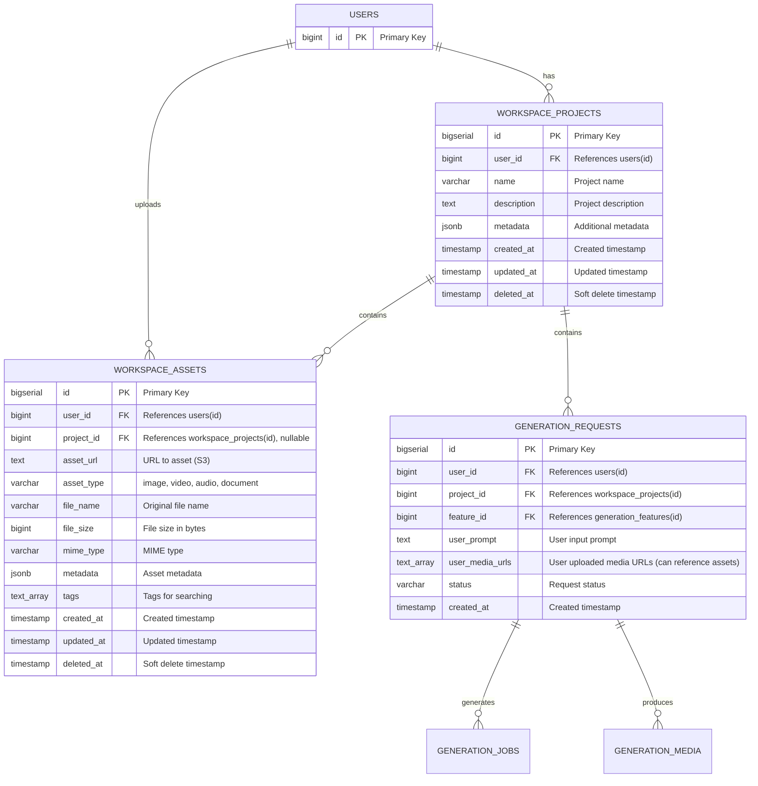

## Workspace Domain – Database Schema

**Mục tiêu**: Quản lý projects và assets của user. Single tenant - mỗi user có projects riêng.

Database: PostgreSQL.

---

## 1. Overview & Design Principles

- **User → Projects → Requests**: Flow đơn giản, mỗi user có nhiều projects, mỗi project có nhiều requests.
- **Assets Management**: User có thể upload và quản lý assets để reuse trong các requests.
- **Single Tenant**: Không có workspace sharing, mỗi user quản lý projects của mình.
- **Soft delete**: Tất cả bảng có `created_at`, `updated_at`, `deleted_at`.

---

---

## 3. Tables

### 3.1. `workspace_projects`

**Vai trò**: Container cho các requests của user. Mỗi project có thể chứa nhiều requests.

```sql
CREATE TABLE workspace_projects (
    id              BIGSERIAL PRIMARY KEY,
    user_id         BIGINT NOT NULL REFERENCES users(id) ON DELETE CASCADE,
    
    name            VARCHAR(255) NOT NULL,           -- Project name
    description     TEXT,                            -- Project description (optional)
    
    -- Metadata
    metadata        JSONB,                           -- Additional metadata (e.g., {"campaign": "...", "brand": "..."})
    
    created_at      TIMESTAMP WITH TIME ZONE NOT NULL DEFAULT NOW(),
    updated_at      TIMESTAMP WITH TIME ZONE NOT NULL DEFAULT NOW(),
    deleted_at      TIMESTAMP WITH TIME ZONE
);

CREATE INDEX idx_workspace_projects_user_id ON workspace_projects(user_id) WHERE deleted_at IS NULL;
CREATE INDEX idx_workspace_projects_deleted_at ON workspace_projects(deleted_at);
```

**MVP**:
- **Bắt buộc**: `id`, `user_id`, `name`, `created_at`, `updated_at`.
- **Optional**: `description`, `metadata`.

---

### 3.2. `workspace_assets`

**Vai trò**: Quản lý assets (images, videos, documents) mà user upload để reuse trong các requests.

```sql
CREATE TABLE workspace_assets (
    id              BIGSERIAL PRIMARY KEY,
    user_id         BIGINT NOT NULL REFERENCES users(id) ON DELETE CASCADE,
    project_id      BIGINT REFERENCES workspace_projects(id) ON DELETE SET NULL,  -- Optional: link to project
    
    -- Asset info
    asset_url       TEXT NOT NULL,                   -- URL to asset (S3 link)
    asset_type      VARCHAR(32),                     -- image, video, audio, document
    file_name       VARCHAR(255),                    -- Original file name
    file_size       BIGINT,                          -- File size in bytes
    mime_type       VARCHAR(128),                    -- MIME type (e.g., "image/png", "video/mp4")
    
    -- Metadata
    metadata        JSONB,                           -- Asset metadata (e.g., {"width": 1920, "height": 1080, "duration": 30})
    tags            TEXT[],                          -- Tags for searching/filtering (optional)
    
    created_at      TIMESTAMP WITH TIME ZONE NOT NULL DEFAULT NOW(),
    updated_at      TIMESTAMP WITH TIME ZONE NOT NULL DEFAULT NOW(),
    deleted_at      TIMESTAMP WITH TIME ZONE
);

CREATE INDEX idx_workspace_assets_user_id ON workspace_assets(user_id) WHERE deleted_at IS NULL;
CREATE INDEX idx_workspace_assets_project_id ON workspace_assets(project_id) WHERE project_id IS NOT NULL AND deleted_at IS NULL;
CREATE INDEX idx_workspace_assets_type ON workspace_assets(asset_type) WHERE deleted_at IS NULL;
CREATE INDEX idx_workspace_assets_user_type ON workspace_assets(user_id, asset_type) WHERE deleted_at IS NULL;
CREATE INDEX idx_workspace_assets_tags ON workspace_assets USING GIN(tags) WHERE deleted_at IS NULL;
CREATE INDEX idx_workspace_assets_deleted_at ON workspace_assets(deleted_at);
```

**Use Cases**:
- User upload image → lưu vào `workspace_assets`
- Khi tạo request, user có thể chọn từ assets đã upload
- `generation_requests.user_media_urls` có thể reference assets này

**MVP**:
- **Bắt buộc**: `id`, `user_id`, `asset_url`, `created_at`, `updated_at`.
- **Optional**: `project_id`, `asset_type`, `file_name`, `file_size`, `mime_type`, `metadata`, `tags`.

---

## 4. Entity Relationship Diagram (ERD)



### Relationship Details:

- **USERS → WORKSPACE_PROJECTS**: One-to-Many
  - Một user có nhiều projects
  - Khi user bị xóa → CASCADE (tất cả projects bị xóa)

- **USERS → WORKSPACE_ASSETS**: One-to-Many
  - Một user có nhiều assets
  - Khi user bị xóa → CASCADE (tất cả assets bị xóa)

- **WORKSPACE_PROJECTS → WORKSPACE_ASSETS**: One-to-Many (Optional)
  - Một project có thể có nhiều assets (nếu user link assets vào project)
  - Khi project bị xóa → SET NULL (assets giữ lại nhưng project_id = NULL)

- **WORKSPACE_PROJECTS → GENERATION_REQUESTS**: One-to-Many
  - Một project có nhiều requests
  - Khi project bị xóa → CASCADE (tất cả requests bị xóa, đã có trong generation schema)

---

## 5. Integration với Generation Schema

### 5.1. `generation_requests.project_id`
- Reference đến `workspace_projects.id`
- Đã có trong generation schema (nullable cho MVP)
- Khi có project → link request vào project

### 5.2. `generation_requests.user_media_urls`
- Có thể reference đến `workspace_assets.asset_url`
- User có thể chọn từ assets đã upload thay vì upload lại

### 5.3. `generation_jobs.project_id`
- Denormalized từ request
- Đã có trong generation schema

---

## 6. Workflow

### 6.1. Project Creation
1. User tạo project → `workspace_projects` record
2. User có thể upload assets → `workspace_assets` records
3. User tạo requests trong project → `generation_requests` với `project_id`

### 6.2. Asset Usage
1. User upload asset → lưu vào `workspace_assets`
2. Khi tạo request, user chọn asset từ list
3. `generation_requests.user_media_urls` chứa URL từ asset

---

## 7. Soft Delete & Data Retention

- `workspace_projects`:
  - Soft delete để giữ lại lịch sử projects
  - Có thể archive sau một khoảng thời gian

- `workspace_assets`:
  - Soft delete để giữ lại references
  - Khi asset bị xóa, file trên S3 có thể được cleanup sau một khoảng thời gian

---

## 8. Quan hệ với các domain khác

- **Identity Domain**:
  - `workspace_projects` và `workspace_assets` reference `users.id`.

- **Generation Domain**:
  - `generation_requests.project_id` reference `workspace_projects.id`.
  - `generation_requests.user_media_urls` có thể reference `workspace_assets.asset_url`.

- **Billing Domain**:
  - Quota/limits được quản lý ở user level (Billing domain).

---

## 9. MVP Considerations

### Bảng bắt buộc cho MVP:
- **`workspace_projects`**: Core table để quản lý projects
- **`workspace_assets`**: Quản lý assets để reuse

### Fields có thể bỏ cho MVP:
- `workspace_projects.metadata`: Có thể bỏ nếu không cần extra data
- `workspace_assets.tags`: Có thể bỏ nếu không cần search/filter
- `workspace_assets.metadata`: Có thể bỏ nếu không cần extra data

---

**Last Updated**: December 28, 2025

