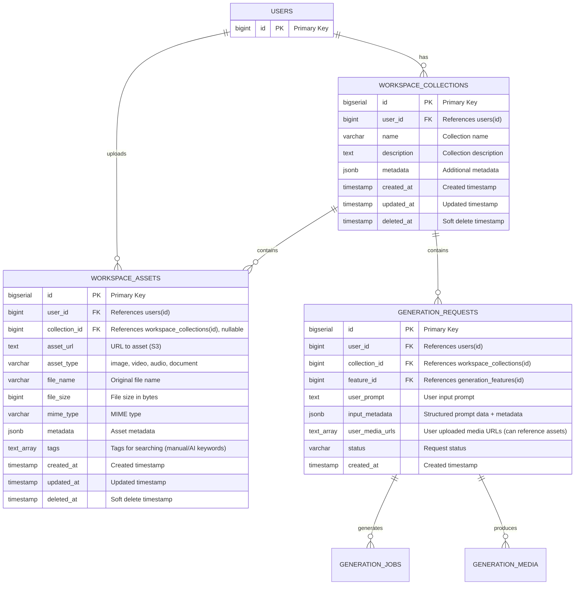

## Workspace Domain – Database Schema

**Mục tiêu**: Quản lý collections và assets của user. Single tenant - mỗi user có collections riêng.

Database: PostgreSQL.

---

## 1. Overview & Design Principles

- **User → Collections → Requests**: Flow đơn giản, mỗi user có nhiều collections, mỗi collection có nhiều requests.
- **Collections over Projects**: Single Player không cần cấu trúc Project nặng nề. Collections/Tags tự nhiên hơn cho creative workflow.
- **Default Collection**: "Unsorted" - không bắt user đặt tên trước khi sáng tạo, giảm friction.
- **Assets Management**: User có thể upload và quản lý assets để reuse trong các requests.
- **Single Tenant**: Không có workspace sharing, mỗi user quản lý collections của mình.
- **Soft delete**: Tất cả bảng có `created_at`, `updated_at`, `deleted_at`.

---

---

## 3. Tables

### 3.1. `workspace_collections`

**Vai trò**: Container cho các requests của user. Mỗi collection có thể chứa nhiều requests. Renamed from `workspace_projects` để phù hợp với Single Player workflow (Collections/Tags tự nhiên hơn Projects).

```sql
CREATE TABLE workspace_collections (
    id              BIGSERIAL PRIMARY KEY,
    user_id         BIGINT NOT NULL REFERENCES users(id) ON DELETE CASCADE,

    name            VARCHAR(255) NOT NULL,           -- Collection name (default: "Unsorted" for new users)
    description     TEXT,                            -- Collection description (optional)

    -- Metadata
    metadata        JSONB,                           -- Additional metadata (e.g., {"campaign": "...", "brand": "..."})

    created_at      TIMESTAMP WITH TIME ZONE NOT NULL DEFAULT NOW(),
    updated_at      TIMESTAMP WITH TIME ZONE NOT NULL DEFAULT NOW(),
    deleted_at      TIMESTAMP WITH TIME ZONE
);

CREATE INDEX idx_workspace_collections_user_id ON workspace_collections(user_id) WHERE deleted_at IS NULL;
CREATE INDEX idx_workspace_collections_deleted_at ON workspace_collections(deleted_at);
```

**MVP**:

- **Bắt buộc**: `id`, `user_id`, `name`, `created_at`, `updated_at`.
- **Optional**: `description`, `metadata`.
- **Default Collection**: System creates "Unsorted" collection automatically for new users.

---

### 3.2. `workspace_assets`

**Vai trò**: Quản lý assets (images, videos, documents) mà user upload để reuse trong các requests.

```sql
CREATE TABLE workspace_assets (
    id              BIGSERIAL PRIMARY KEY,
    user_id         BIGINT NOT NULL REFERENCES users(id) ON DELETE CASCADE,
    collection_id   BIGINT REFERENCES workspace_collections(id) ON DELETE SET NULL,  -- Optional: link to collection (renamed from project_id)

    -- Asset info
    asset_url       TEXT NOT NULL,                   -- URL to asset (S3 link)
    asset_type      VARCHAR(32),                     -- image, video, audio, document
    file_name       VARCHAR(255),                    -- Original file name
    file_size       BIGINT,                          -- File size in bytes
    mime_type       VARCHAR(128),                    -- MIME type (e.g., "image/png", "video/mp4")

    -- Metadata
    metadata        JSONB,                           -- Asset metadata (e.g., {"width": 1920, "height": 1080, "duration": 30})
    tags            TEXT[],                          -- Tags for searching/filtering (manual/AI keyword tags, not vectors)

    created_at      TIMESTAMP WITH TIME ZONE NOT NULL DEFAULT NOW(),
    updated_at      TIMESTAMP WITH TIME ZONE NOT NULL DEFAULT NOW(),
    deleted_at      TIMESTAMP WITH TIME ZONE
);

CREATE INDEX idx_workspace_assets_user_id ON workspace_assets(user_id) WHERE deleted_at IS NULL;
CREATE INDEX idx_workspace_assets_collection_id ON workspace_assets(collection_id) WHERE collection_id IS NOT NULL AND deleted_at IS NULL;
CREATE INDEX idx_workspace_assets_type ON workspace_assets(asset_type) WHERE deleted_at IS NULL;
CREATE INDEX idx_workspace_assets_user_type ON workspace_assets(user_id, asset_type) WHERE deleted_at IS NULL;
CREATE INDEX idx_workspace_assets_tags ON workspace_assets USING GIN(tags) WHERE deleted_at IS NULL;
CREATE INDEX idx_workspace_assets_deleted_at ON workspace_assets(deleted_at);
```

**Use Cases**:

- User upload image → lưu vào `workspace_assets`
- Khi tạo request, user có thể chọn từ assets đã upload
- `generation_requests.user_media_urls` có thể reference assets này

**MVP**:

- **Bắt buộc**: `id`, `user_id`, `asset_url`, `created_at`, `updated_at`.
- **Optional**: `collection_id` (renamed from project_id), `asset_type`, `file_name`, `file_size`, `mime_type`, `metadata`, `tags`.

---

## 4. Entity Relationship Diagram (ERD)



### Relationship Details

- **USERS → WORKSPACE_COLLECTIONS**: One-to-Many
  - Một user có nhiều collections
  - Khi user bị xóa → CASCADE (tất cả collections bị xóa)
  - Default collection "Unsorted" được tạo tự động cho user mới

- **USERS → WORKSPACE_ASSETS**: One-to-Many
  - Một user có nhiều assets
  - Khi user bị xóa → CASCADE (tất cả assets bị xóa)

- **WORKSPACE_COLLECTIONS → WORKSPACE_ASSETS**: One-to-Many (Optional)
  - Một collection có thể có nhiều assets (nếu user link assets vào collection)
  - Khi collection bị xóa → SET NULL (assets giữ lại nhưng collection_id = NULL)

- **WORKSPACE_COLLECTIONS → GENERATION_REQUESTS**: One-to-Many
  - Một collection có nhiều requests
  - Khi collection bị xóa → CASCADE (tất cả requests bị xóa, đã có trong generation schema)

---

## 5. Integration với Generation Schema

### 5.1. `generation_requests.collection_id`

- Reference đến `workspace_collections.id` (renamed from `project_id`)
- Đã có trong generation schema (nullable cho MVP)
- Khi có collection → link request vào collection
- **Migration**: Update `project_id` → `collection_id` trong generation schema

### 5.2. `generation_requests.user_media_urls`

- Có thể reference đến `workspace_assets.asset_url`
- User có thể chọn từ assets đã upload thay vì upload lại
- **Future**: Semantic search sẽ giúp user tìm assets bằng ngữ nghĩa (e.g., "red shirt" tìm được ảnh dù filename là `IMG_123.jpg`)

### 5.3. `generation_jobs.collection_id`

- Denormalized từ request (renamed from `project_id`)
- Đã có trong generation schema

---

## 6. Workflow

### 6.1. Collection Creation

1. System tự động tạo "Unsorted" collection cho user mới (không bắt user đặt tên trước khi sáng tạo)
2. User có thể tạo collection mới → `workspace_collections` record
3. User có thể upload assets → `workspace_assets` records
4. User tạo requests trong collection → `generation_requests` với `collection_id`

### 6.2. Asset Usage

1. User upload asset → lưu vào `workspace_assets`
2. Khi tạo request, user chọn asset từ list
3. `generation_requests.user_media_urls` chứa URL từ asset

---

## 7. Soft Delete & Data Retention

- `workspace_collections`:
  - Soft delete để giữ lại lịch sử collections
  - Có thể archive sau một khoảng thời gian

- `workspace_assets`:
  - Soft delete để giữ lại references
  - Khi asset bị xóa, file trên S3 có thể được cleanup sau một khoảng thời gian

---

## 8. Quan hệ với các domain khác

- **Identity Domain**:
  - `workspace_collections` và `workspace_assets` reference `users.id`.

- **Generation Domain**:
  - `generation_requests.collection_id` reference `workspace_collections.id` (renamed from `project_id`).
  - `generation_requests.user_media_urls` có thể reference `workspace_assets.asset_url`.

- **Billing Domain**:
  - Quota/limits được quản lý ở user level (Billing domain).

---

## 9. MVP Considerations

### Bảng bắt buộc cho MVP

- **`workspace_collections`**: Core table để quản lý collections (renamed from `workspace_projects`)
- **`workspace_assets`**: Quản lý assets để reuse

### Fields có thể bỏ cho MVP

- `workspace_collections.metadata`: Có thể bỏ nếu không cần extra data
- `workspace_assets.tags`: Có thể bỏ nếu không cần search/filter
- `workspace_assets.metadata`: Có thể bỏ nếu không cần extra data

---

**Last Updated**: December 28, 2025

TODO:
