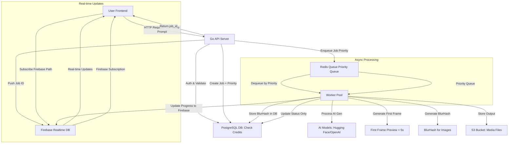

# System Architecture (High-Level Design)

## 1. Overview

- Microservices-based
- API frontend -> simple requests
- Queue -> offload heavy tasks (AI generation)
- Workers xử lý async. 
=> Điều này đảm bảo scalability (handle 1000 users), low latency cho UI, và fault-tolerance.

- **Components**:
  - **API Server (Go)**: Xử lý auth (Google Oauth2), requests từ users (e.g., gen video prompt).
  - **Queue/Messaging**: Redis (simple queue).
  - **Workers**: Multiple instances (scale horizontally) chạy AI models (e.g., Stable Diffusion for images, TTS for voice).
  - **Database**: PostgreSQL cho metadata (source of truth) - stores lifecycle states only (`pending`, `processing`, `completed`, `failed`).
  - **Real-time Signaling**: Firebase Realtime Database cho real-time job status updates (Sidecar Sync pattern) - stores ephemeral high-frequency data (`progress: 0-100%`, `step: "..."`, `previewURL`).
  - **Storage**: S3 cho output files (videos/images).
  - **Frontend**: Web app (React) gọi API. Astro cho landing page.

## 2. Data Flow Diagram
Dưới đây là luồng dữ liệu chính (User → API → Queue → Worker → Storage → Back to User) với Firebase Realtime Database cho real-time updates và BlurHash.

Luồng Chi Tiết:

- User gửi prompt qua API (e.g., POST /generate/video).
- API validate (auth, credits), tạo Job record in DB với `priority` field, enqueue vào Redis Priority Queue.
- API push initial state vào Firebase `/user_jobs/{uid}/{job_id}` với `status: 'pending'`, `progress: 0`.
- API trả về `job_id` cho Client.
- **Firebase Subscription**: Client subscribe Firebase path `/user_jobs/{uid}/{job_id}` ngay lập tức.
- Worker dequeue theo priority (Pro users $49.99 được ưu tiên hơn Free users).
- Worker update `worker_id` trong job để trace GPU đang xử lý.
- **First Frame Preview** (Video): Worker extract first frame → Upload to S3 → Update Firebase với `result.thumbnail_url`.
- **BlurHash** (Images): Worker generate BlurHash → Store in DB → Update Firebase với `result.blurhash`.
- Worker chạy AI gen (e.g., text-to-video model), upload output to S3.
- Worker update Job status trong DB (lifecycle state changes only: `pending` → `processing` → `completed`/`failed`).
- Worker update progress (0-100%) trực tiếp vào Firebase, không ghi vào Postgres (tránh write amplification).
- **Firebase Events**: Client tự động nhận updates qua Firebase subscription (status, progress, step, result, error).
- Client hiển thị BlurHash/First Frame Preview ngay lập tức, replace với full media khi ready.

## 3. Key Decisions

### 3.1. Technology Stack
- **Why Go?**: Lightweight, concurrent (goroutines phù hợp workers), low memory.
- **Redis vs NATS**: Redis cho simple queue + cache (credits) + priority queue support.
- **Firebase over Polling/SSE**: Firebase Realtime Database provides real-time progress updates without polling or managing SSE connections. Client SDK handles reconnection automatically, reducing server load and improving UX.
- **PostgreSQL as Source of Truth**: All persistent data stored in PostgreSQL. Firebase is ephemeral signaling layer (Sidecar Sync pattern).
- **Scalability**: Auto-scale workers via Docker; CDN for S3 downloads.

### 3.2. UX Optimizations
- **BlurHash**: Generate and store BlurHash strings in DB (required field) for instant image placeholders. Client loads BlurHash immediately (< 100ms) from Firebase, then lazy loads full image from S3.
- **First Frame Preview**: Video generation returns first frame preview within < 5s via Firebase, providing instant feedback while full video generates.
- **Priority Queue**: Pro users ($49.99) get higher priority than Free users via `priority` field in `generation_jobs`.
- **Optimistic UI**: Display placeholders/previews immediately via Firebase subscription, replace with full content when ready.
- **Real-time Progress**: Firebase subscription provides instant progress updates (percentage, step text) without polling overhead.

### 3.3. Error Handling & Reliability
- **Idempotency**: `idempotency_key` trong `credit_transactions` prevents double-charging on worker retry.
- **Worker Tracing**: `worker_id` field tracks which GPU worker is processing each job for debugging.
- **Retry queue**: Redis dead-letter queue cho failed jobs.
- **Firebase Reconnection**: Firebase SDK automatically reconnects on connection drop. If Firebase unavailable, client can fallback to polling Postgres API.
- **Data Consistency**: Split-state architecture - Postgres stores only lifecycle states (`pending`, `processing`, `completed`, `failed`). Firebase stores ephemeral high-frequency data (`progress: 0-100%`, `step: "..."`, `previewURL`). Worker updates Postgres only on lifecycle state changes, all progress updates go directly to Firebase. If Firebase data lost, can rebuild from Postgres (but progress history will be lost, which is acceptable for ephemeral data).

### 3.4. Future Enhancements (NOT in MVP)
- **Database Triggers**: Stored procedures for balance integrity (currently application-level with idempotency protection).
- **Firebase Cleanup Automation**: Cloud Functions để tự động cleanup Firebase data sau 24h.

Last Updated: December 28, 2025