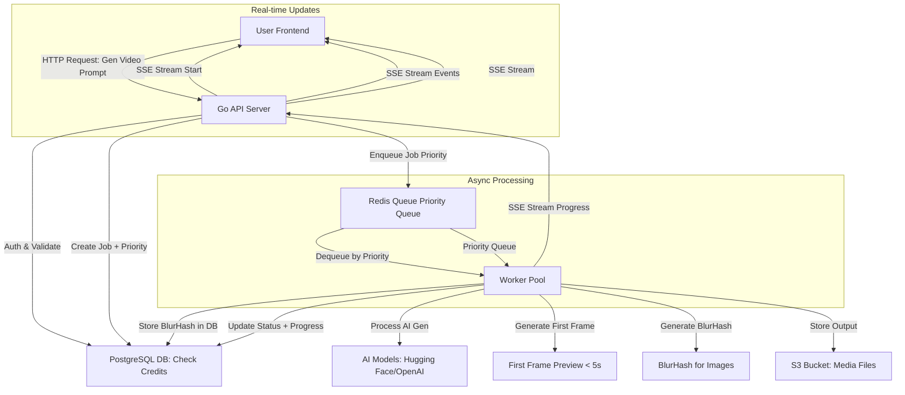

# System Architecture (High-Level Design)

## 1. Overview

- Microservices-based
- API frontend -> simple requests
- Queue -> offload heavy tasks (AI generation)
- Workers xử lý async. 
=> Điều này đảm bảo scalability (handle 1000 users), low latency cho UI, và fault-tolerance.

- **Components**:
  - **API Server (Go)**: Xử lý auth (Google Oauth2), requests từ users (e.g., gen video prompt).
  - **Queue/Messaging**: Redis (simple queue).
  - **Workers**: Multiple instances (scale horizontally) chạy AI models (e.g., Stable Diffusion for images, TTS for voice).
  - **Database**: PostgreSQL cho metadata.
  - **Storage**: S3 cho output files (videos/images).
  - **Frontend**: Web app (React) gọi API. Astro cho landing page.

## 2. Data Flow Diagram
Dưới đây là luồng dữ liệu chính (User → API → Queue → Worker → Storage → Back to User) với SSE streaming và BlurHash.

Luồng Chi Tiết:

- User gửi prompt qua API (e.g., POST /generate/video).
- API validate (auth, credits), tạo Job record in DB với `priority` field, enqueue vào Redis Priority Queue.
- **SSE Stream**: API bắt đầu SSE stream ngay lập tức (`/api/generate/{job_id}/stream`).
- Worker dequeue theo priority (Pro users $49.99 được ưu tiên hơn Free users).
- Worker update `worker_id` trong job để trace GPU đang xử lý.
- **First Frame Preview** (Video): Worker extract first frame → Upload to S3 → Return URL via SSE trong < 5s.
- **BlurHash** (Images): Worker generate BlurHash → Store in DB → Return via SSE.
- Worker chạy AI gen (e.g., text-to-video model), upload output to S3.
- Worker update Job status in DB, stream progress updates via SSE.
- **SSE Events**: Status updates, percentage completion, preview frames, error notifications.
- Client hiển thị BlurHash/First Frame Preview ngay lập tức, replace với full media khi ready.

## 3. Key Decisions

### 3.1. Technology Stack
- **Why Go?**: Lightweight, concurrent (goroutines phù hợp workers), low memory.
- **Redis vs NATS**: Redis cho simple queue + cache (credits) + priority queue support.
- **SSE over Polling**: Server-Sent Events provide real-time progress updates without constant polling, reducing server load and improving UX.
- **Scalability**: Auto-scale workers via Docker; CDN for S3 downloads.

### 3.2. UX Optimizations
- **BlurHash**: Generate and store BlurHash strings in DB for instant image placeholders. Client loads BlurHash immediately (< 100ms), then lazy loads full image from S3.
- **First Frame Preview**: Video generation returns first frame preview within < 5s via SSE, providing instant feedback while full video generates.
- **Priority Queue**: Pro users ($49.99) get higher priority than Free users via `priority` field in `generation_jobs`.
- **Optimistic UI**: Display placeholders/previews immediately, replace with full content when ready.

### 3.3. Error Handling & Reliability
- **Idempotency**: `idempotency_key` trong `credit_transactions` prevents double-charging on worker retry.
- **Worker Tracing**: `worker_id` field tracks which GPU worker is processing each job for debugging.
- **Retry queue**: Redis dead-letter queue cho failed jobs.
- **SSE Reconnection**: Client automatically reconnects SSE stream on connection drop.

### 3.4. Future Enhancements (NOT in MVP)
- **Semantic Search**: pgvector + embedding vectors trong `workspace_assets` for semantic asset search.
- **Database Triggers**: Stored procedures for balance integrity (currently application-level with idempotency protection).

Last Updated: December 28, 2025