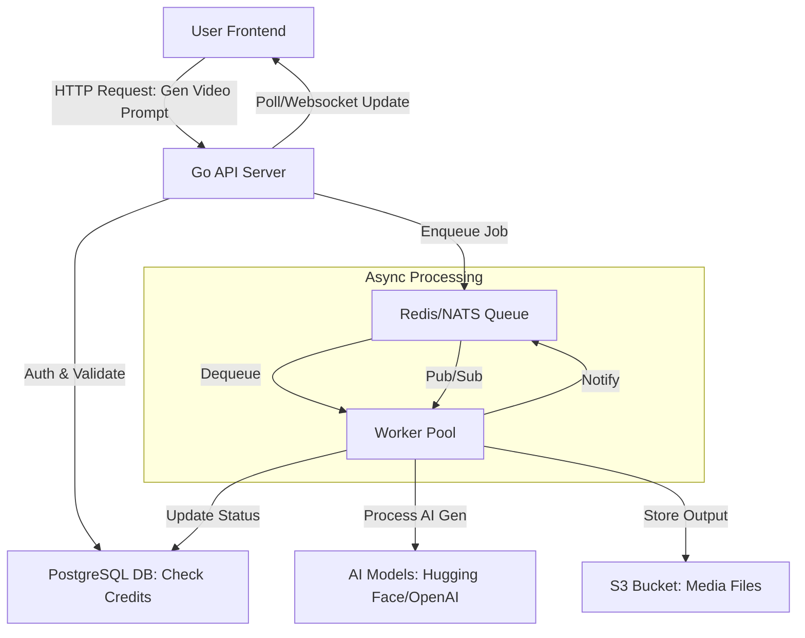

# System Architecture (High-Level Design)

## 1. Overview

- Microservices-based
- API frontend -> simple requests
- Queue -> offload heavy tasks (AI generation)
- Workers xử lý async. 
=> Điều này đảm bảo scalability (handle 1000 users), low latency cho UI, và fault-tolerance.

- **Components**:
  - **API Server (Go)**: Xử lý auth (Google Oauth2), requests từ users (e.g., gen video prompt).
  - **Queue/Messaging**: Redis (simple queue).
  - **Workers**: Multiple instances (scale horizontally) chạy AI models (e.g., Stable Diffusion for images, TTS for voice).
  - **Database**: PostgreSQL cho metadata.
  - **Storage**: S3 cho output files (videos/images).
  - **Frontend**: Web app (React) gọi API. Astro cho landing page.

## 2. Data Flow Diagram
Dưới đây là luồng dữ liệu chính (User → API → Queue → Worker → Storage → Back to User).

Luồng Chi Tiết:

- User gửi prompt qua API (e.g., POST /generate/video).
- API validate (auth, credits), tạo Job record in DB, enqueue vào Redis/NATS.
- Worker dequeue, chạy AI gen (e.g., text-to-video model), upload output to S3.
- Worker update Job status in DB, publish notification via NATS.
- API notify user qua Websocket hoặc polling (e.g., job done, download link). (Prefer dùng firebase)

## 3. Key Decisions

Why Go?: Lightweight, concurrent (goroutines phù hợp workers), low memory.
Redis vs NATS: Redis cho simple queue + cache (credits).
Scalability: Auto-scale workers via Docker; CDN for S3 downloads.
Error Handling: Retry queue (Redis), dead-letter queue cho failed jobs.

Last Updated: December 28, 2025